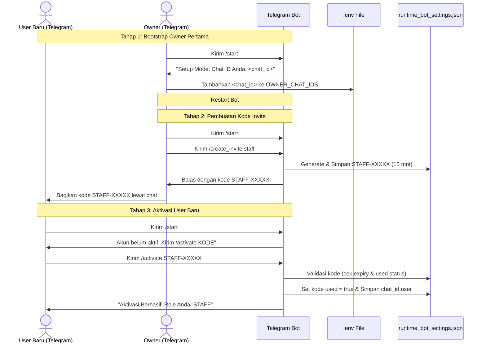

# Security and Roles Foundation (V5C)

Dokumen ini menjelaskan arsitektur keamanan, otentikasi, otorisasi, dan manajemen hak akses (role) pada sistem **Streamlit Dashboard** dan **Telegram Bot**.

---

## 1. Konfigurasi Otentikasi & Role Streamlit
Dashboard Streamlit menggunakan sistem login berbasis *username* & *password hash* dengan pembagian 3 role utama:
* **`owner`**: Akses penuh ke seluruh halaman, ekspor data, pengaturan pajak, dan manajemen.
* **`staff`**: Akses penuh ke operasional (stok, plan produksi, chat AI, setup upload), tetapi diblokir dari menu **Finance & Tax** dan ekspor SPT.
* **`viewer`**: Akses bersifat *readonly* terbatas ke halaman Overview, Owner Control Room, Laporan Harian, dan Data Health Check. Seluruh tombol ekspor/unduh PDF/TXT dinonaktifkan.

### Cara Setup Akun di `secrets.toml`
Untuk mengaktifkan sistem login di Streamlit, Anda wajib menambahkan tabel konfigurasi akun di berkas `.streamlit/secrets.toml` (lokal) atau di panel **Secrets** Streamlit Cloud. 

#### Contoh Konfigurasi (secrets.toml):
```toml
[auth_users.owner]
username = "owner"
password_hash = "f339cf3d5bc0d17676615b3c37341e97669d068cb187514a6015dc3dfc58d042" # hash dari password "owner123"
role = "owner"
display_name = "Owner Utama"

[auth_users.staff]
username = "staff"
password_hash = "6bc91f24d35e1654bb049e612140bb60cfd03c27e056d68b92bde44cdffc04db" # hash dari password "staff123"
role = "staff"
display_name = "Staff Gudang"

[auth_users.viewer]
username = "viewer"
password_hash = "ef1d1bb73315a6e8731d102dc80562e6e3009943fcfcb5351f041ff34e2b09ee" # hash dari password "viewer123"
role = "viewer"
display_name = "Investor Viewer"
```

> [!NOTE]
> * Password disimpan dalam bentuk hash hex menggunakan algoritma **PBKDF2-HMAC-SHA256** bawaan Python (`hashlib.pbkdf2_hmac`) dengan *salt* konstan demi keamanan.
> * Jika tabel `[auth_users]` tidak ditemukan pada berkas secrets, aplikasi otomatis berjalan dalam **DEMO MODE** dengan warning di atas layar agar aplikasi tidak crash dan mempermudah uji coba lokal/review.

---

## 2. Alur Aktivasi & Registrasi User Telegram Bot

Sistem Telegram Bot tidak menggunakan password statis karena kerawanan kebocoran riwayat chat. Bot menggunakan alur **Auto Chat ID Detection** + **Invite Code System** sekali pakai (valid 15 menit).



### Langkah 1: Bootstrap Owner Pertama
1. Pengguna utama (owner) mencari bot di Telegram lalu mengirimkan perintah `/start`.
2. Jika konfigurasi `OWNER_CHAT_IDS` di berkas `.env` masih kosong, bot akan masuk ke **Setup Mode** dan menampilkan pesan:
   > 🤖 **Bot Setup Mode**  
   > OWNER_CHAT_IDS belum dikonfigurasi di file .env.  
   > Chat ID Anda: `987654321`  
   > Silakan masukkan chat ID ini ke OWNER_CHAT_IDS di file .env, lalu restart bot.
3. Owner menyalin angka chat ID tersebut, memasukkannya ke berkas `.env`:
   ```env
   OWNER_CHAT_IDS=987654321
   ```
4. Restart bot. Sekarang akun owner pertama telah aktif permanen dari level environment.

### Langkah 2: Pembuat Invite Code (Hanya Owner)
Owner dapat mendaftarkan staff atau investor (viewer) dengan membuat kode invite sekali pakai:
* `/create_invite staff` - Menghasilkan kode contoh: `STAFF-8H39K`
* `/create_invite viewer` - Menghasilkan kode contoh: `VIEWER-7L20P`

Kode ini berlaku selama **15 menit** dan disimpan di berkas lokal `runtime_bot_settings.json` (tidak masuk Git).

### Langkah 3: Aktivasi User Baru
1. User baru membuka bot di Telegram dan menekan `/start`.
2. Bot mendeteksi chat ID belum terdaftar, lalu membalas:
   > ❌ **Akun Telegram Anda belum aktif.**  
   > Minta kode aktivasi dari owner, lalu kirim: `/activate KODE`  
   > Chat ID Anda: `11223344`
3. User baru mengirimkan perintah aktivasi menggunakan kode dari owner:
   ```text
   /activate STAFF-8H39K
   ```
4. Bot memvalidasi kode tersebut. Jika valid, chat ID user tersebut akan langsung disimpan di runtime settings dengan role yang sesuai, dan bot mengirim pesan sukses.

---

## 3. Matriks Hak Akses (Role Permission Matrix)

| Fitur / Halaman / Command | Kode Perintah / Menu | Owner | Staff | Viewer |
| :--- | :--- | :---: | :---: | :---: |
| **Streamlit Dashboard** | | | | |
| Owner Control Room | `Owner Control Room` | ✅ | ✅ | ✅ *(Readonly)* |
| Dashboard Overview | `Dashboard Overview` | ✅ | ✅ | ✅ *(Readonly)* |
| Stok, HPP & Produksi | `Stok, HPP & Produksi` | ✅ | ✅ | ❌ |
| Chatbot AI Bisnis | `Chatbot AI Bisnis` | ✅ | ✅ | ❌ |
| Laporan Harian | `Laporan Harian` | ✅ | ✅ | ✅ *(Readonly)* |
| Finance & Tax | `Finance & Tax` | ✅ | ❌ | ❌ |
| Setup Data | `Setup Data` | ✅ | ✅ *(Upload)* | ❌ |
| Data Health Check | `Data Health Check` | ✅ | ✅ | ✅ *(Readonly)* |
| Data Dummy | `Data Dummy` | ✅ | ✅ | ❌ |
| **Telegram Bot** | | | | |
| Start & Help | `/start`, `/help` | ✅ | ✅ | ✅ |
| Business Ringkasan | `/summary` | ✅ | ✅ | ✅ |
| Owner Action Plan | `/owner` | ✅ | ✅ | ✅ |
| Unduh PDF Harian | `/report` | ✅ | ✅ | ❌ |
| Deteksi Anomali / Alert | `/alert_check` | ✅ | ✅ | ❌ |
| Detail Data | `/top_products`, `/stock`, `/materials`, `/production`, `/ads` | ✅ | ✅ | ❌ |
| Laporan Pajak & SPT | `/finance`, `/tax`, `/tax_report`, `/spt_check`, `/spt_pack` | ✅ | ❌ | ❌ |
| Kontrol Jadwal Otomatis | `/daily_on`, `/daily_off`, `/set_daily_time`, `/closing_on`, `/closing_off`, `/set_closing_time`, `/schedule_status`, `/send_now` | ✅ | ❌ | ❌ |
| Manajemen Otoritas Bot | `/create_invite`, `/list_users`, `/revoke_user` | ✅ | ❌ | ❌ |

---

## 4. Keamanan Telegram: Mengapa Menghindari Password Statis?
Kami secara sadar memutuskan **tidak menggunakan password statis** untuk login via chat Telegram karena beberapa pertimbangan keamanan tingkat tinggi:
1. **Plaintext Leak**: Riwayat pesan chat Telegram tersimpan di cloud Telegram dan dapat dibaca di multi-device. Jika password statis diketik, password tersebut akan terekam secara permanen di riwayat pesan pengirim & penerima.
2. **Brute Force & Session Hijacking**: Bot Telegram terbuka untuk umum. Password statis memicu risiko serangan brute-force otomatis jika tidak ada pembatasan percobaan login.
3. **Pencabutan Akses Terpusat**: Dengan alur aktivasi sekali pakai, hak akses diikat langsung pada level Telegram *Chat ID* unik perangkat. Jika tim resign atau perangkat hilang, owner cukup mengirim perintah pencabutan akses (`/revoke_user <chat_id>`) tanpa perlu mengganti password global yang akan merepotkan staff lain.

---

## 5. Fondasi Audit Log & Konfirmasi Tindakan (Audit Log & Confirmation)

### Audit Log Foundation
Seluruh aktivitas operasional sensitif (seperti ekspor pajak, perubahan role, sinkronisasi data, dll.) dicatat melalui modul `modules/audit_log.py`. Setiap event memiliki metadata lengkap:
* `timestamp`: Kapan aksi dilakukan.
* `user_id`: Pengidentifikasi unik (Chat ID / Username).
* `user_role`: Tingkatan akses pelaku (Owner/Staff/Viewer).
* `action`: Jenis kegiatan (misal: `export_spt_attachment_pack`).
* `status`: Keberhasilan (`success`/`failed`).

Pada versi ini, audit log diformat secara lokal dan siap diintegrasikan untuk penulisan langsung ke Google Sheets pada tahap pengembangan berikutnya.

### Confirmation Foundation
Tindakan kritis yang memerlukan persetujuan ganda (seperti write-back data atau penghapusan data) dilindungi dengan mekanisme konfirmasi (`modules/confirmation.py`):
1. Pengguna mengajukan perubahan -> Sistem menghasilkan kode konfirmasi random 6 digit yang berlaku selama **10 menit**.
2. Sistem menahan tindakan tersebut dalam status pending.
3. Pengguna wajib mengirimkan perintah konfirmasi `/confirm KODE` dari Telegram untuk mengeksekusi tindakan, atau `/cancel` untuk membatalkan.
4. *Write-back* Google Sheets pada versi V5C ini sengaja belum diaktifkan demi meminimalkan risiko modifikasi data secara tidak sengaja sebelum restrukturisasi API selesai.
